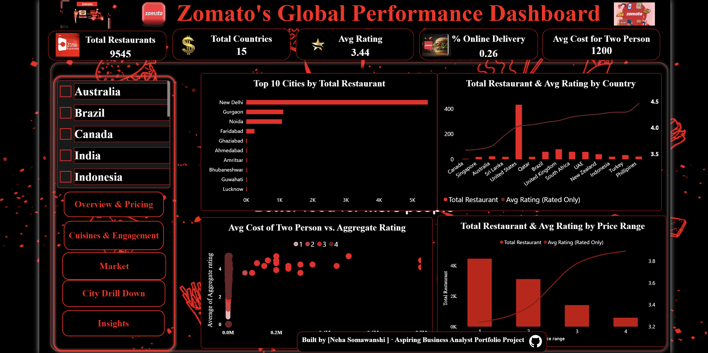
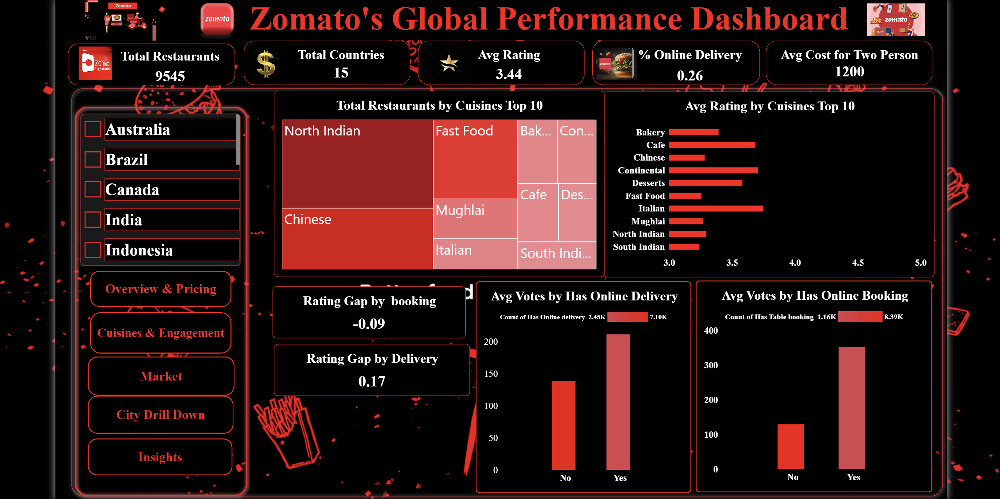
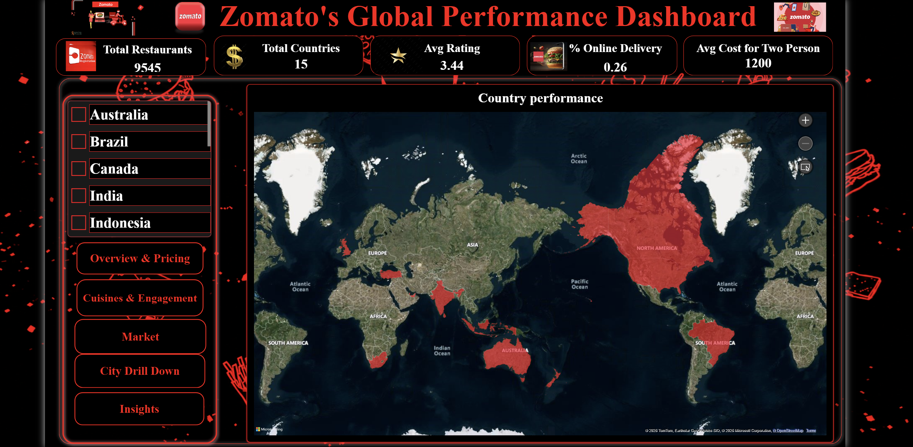
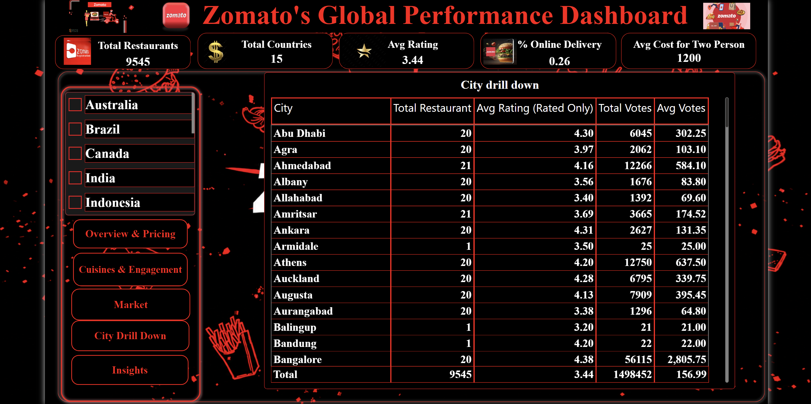
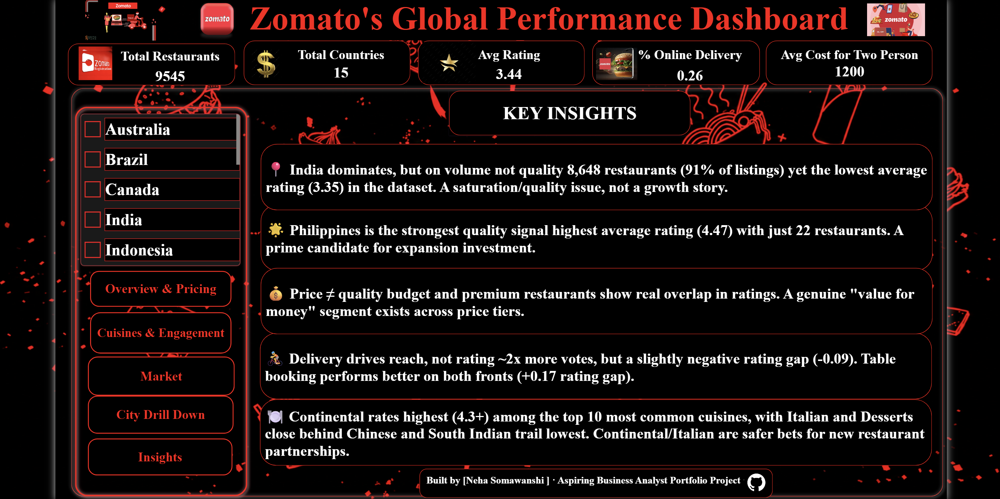

# Zomato Business Intelligence Dashboard

A single-page, navigation driven Power BI dashboard analyzing 9,500+ restaurants across 15 countries, built as a Business Analyst portfolio project. Styled as a branded executive dashboard with bookmark-based section navigation, giving the feel of a multi screen app on one page.

---

## Dashboard Preview








---

## Business Scenario

> "We want to double down on our strongest markets and fix underperforming ones. Give us a dashboard that tells us: where are we winning, where are we losing, and what's driving the difference — price, cuisine mix, or service features like delivery/table booking?"

Full requirements are documented in [`BRD_Zomato_BI_Dashboard_v2.md`](./BRD_Zomato_BI_Dashboard_v2.md).

---

## Dataset

- **Source:** [Zomato Restaurants Data (Kaggle)](https://www.kaggle.com/datasets/shrutimehta/zomato-restaurants-data)
- **Size:** ~9,545 restaurants, 15 countries
- **Fields used:** Restaurant Name, Country, City, Cuisines, Average Cost for Two, Aggregate Rating, Votes, Has Online Delivery, Has Table Booking, Price Range

---

## Dashboard Structure

The dashboard lives on a single page with a persistent header (KPI row + Country/Price Range slicers) and 5 navigable sections, switched via buttons using Power BI bookmarks:

| Section | Business Question | Key Visuals |
|---------|-------------------|-------------|
| **Overview & Pricing** | At a glance, how is Zomato performing, and does cost predict quality? | Top 10 Cities, Total Restaurant & Avg Rating by Country, Cost vs. Rating scatter, Price Range chart |
| **Market** | Which countries are strong vs. underperforming? | World map colored by rating, Country performance table (data bars + color scale) |
| **City Drill Down** | How do individual cities compare? | City-level table (restaurants, rating, votes) |
| **Cuisines & Engagement** | Which cuisines perform best, and do delivery/booking drive engagement? | Top 10 Cuisines treemap + rating bar chart (same ranked set), Votes by Delivery/Booking, Rating Gap callout cards |
| **Insights** | So what? | Summary text panel with headline findings |

Navigation buttons remain visible across all sections, and the Country slicer selection persists when switching sections (bookmark "Data" capture disabled to prevent resets).

---

## Key Insights

- **India** dominates in restaurant count (~8,648, 91% of listings) but has the lowest average rating (3.35) in the dataset — a quality/saturation issue, not a growth story.
- **Philippines** has the highest average rating (4.47) with a small footprint (22 restaurants) — a strong candidate for expansion investment.
- **Price does not reliably predict quality** — budget and premium restaurants show real overlap in ratings, pointing to a genuine "value for money" segment.
- **Online delivery** drives ~2x the customer votes but shows a slightly negative rating gap (-0.09) — a reach lever, not a quality signal.
- **Table booking** shows both higher votes and a modest positive rating gap (+0.17) — a stronger overall recommendation than delivery alone.
- **Continental cuisine rates highest** (4.3+) among the Top 10 most common cuisines, with Italian and Desserts close behind; Chinese and South Indian trail lowest.

---

## Tools & Techniques

- **Power Query:** data cleaning, encoding fixes, column splitting (cuisines split into individual rows via Split by Delimiter → Rows), blank/error handling, whitespace trimming
- **Data Modeling:** country lookup relationship, dedicated cuisine-split table for accurate per-cuisine aggregation
- **DAX:** custom measures for restaurant count, rated-only average rating, votes, cost, and feature-based rating gap comparisons
- **Power BI Desktop:** bookmark-based navigation, Selection Pane visibility toggling, interactive slicers with persistent state, conditional formatting (data bars, color scales), World Map, treemaps, combo charts, custom branded theme

---

## Repository Structure

```
zomato-bi-dashboard/
├── README.md
├── BRD_Zomato_BI_Dashboard_v2.md
├── dashboard/
│   └── Zomato_BI_Dashboard.pbix
├── data/
│   └── data_source_link.txt
├── screenshots/
│   ├── 01_dashboard_overview.png
│   ├── 02_market.png
│   ├── 03_city_drilldown.png
│   ├── 04_cuisines_engagement.png
│   └── 05_insights.png
└── docs/
    └── insights_summary.md
```

---

## How to Use

1. Download the dataset from the [Kaggle link](https://www.kaggle.com/datasets/shrutimehta/zomato-restaurants-data) above
2. Open `dashboard/Zomato_BI_Dashboard.pbix` in Power BI Desktop
3. Refresh the data source to point to your local copy of the dataset
4. Use the navigation buttons at the top to move between sections; use the Country and Price Range slicers to filter

---

## Author

[Your Name] Aspiring Business Analyst
[LinkedIn] · [Portfolio link]
